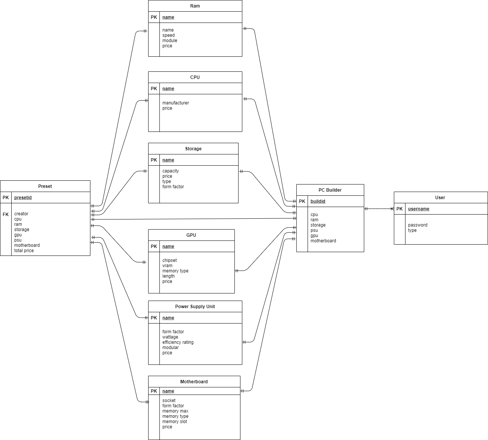
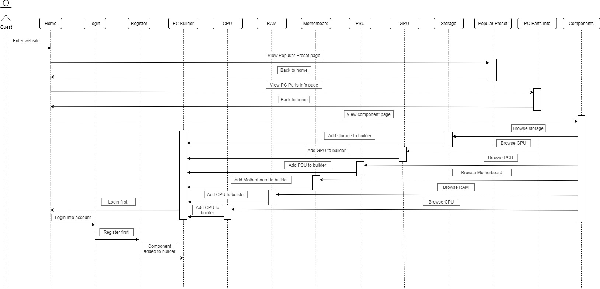
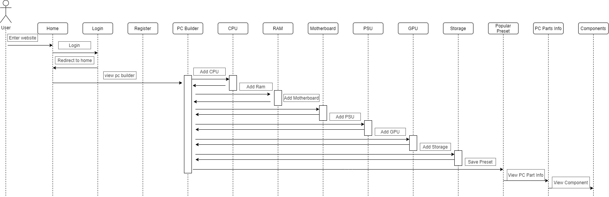
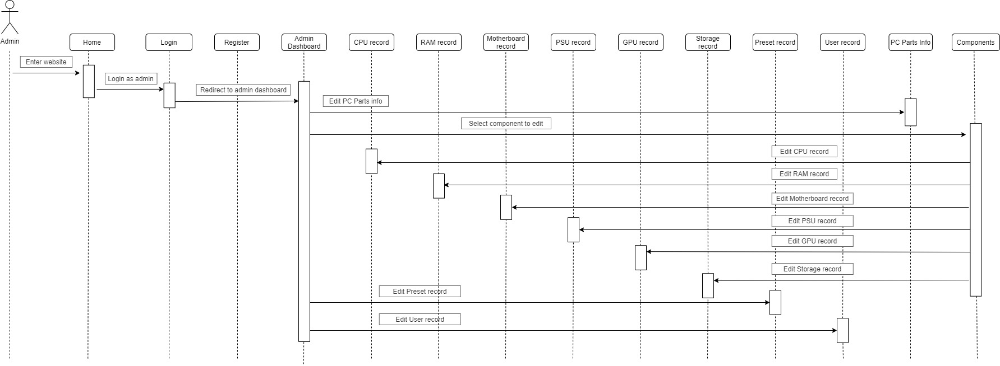

# Group C

<h1> INFO 3305 WEB APPLICATION DEVELOPMENT SECTION 3</h1>
YOUTUBE LINK: https://youtu.be/NpXhao76C1k

<h2> Group Members.</h2>

Ahmad Ammar Arif bin Abdul Aziz - 1919933  
Amir Syazwan bin Ramlan - 1913373  
Amirul Afiq bin Shahdan - 1916491  
Muhammad Akmal bin Anuar - 1911967  
Muhammad Ilham Hakimi bin Mohamad Nizam - 1914359  

<h2>Title: Computer Parts for Beginners </h2>

<h2> Introduction of the proposed web application. </h2>
Nowadays, users are overwhelmed by variety option of computer parts to be chosen. Aside from that, some people are not that expert in determining the best computer parts to build their dreamed PC. Thus, our web application offers a solution where users can see what they get for their budget range. Our project concerning on  developing a web application that summarize the collection of PC parts that can be afforded by the users.  In our web application, we have three sections which is PC Builder, Popular Preset and PC Part Info. Our web application also provide details for computer parts which mainly focus on main components. For registered user, they can have the option to create preset by selecting combination of computer parts. Furthermore, user can enter their budget range and the system will calculate it and suggest the best preset available in our records.

<h2> Objectives of the proposed web application. </h2>
<ol>
 <li>To spread the knowledge on the computer hardware.</li>
 <li>To help user decide the best components for their PC.</li>  
 <li>To help user eliminate some choice that are not relevant for them.</li>
 <li>To suggest user a complete set of computer components within their budget range.</li>
</ol>

<h2> Features and functionalities of the proposed web application. </h2>
<ol>
  <li>Navigation bar - navigate user through the web.</li>
  <li>User registration - a user can register with username, password and other details.</li>
  <li>Computer part registration - admin register computer parts in the database.</li>
  <li>Pick by parts - any user can choose from each computers parts that is available in database.</li>
  <li>Authorization - to distinguish between admin & user.
  <li>Create preset - create a preset based on selected computer parts only for registered user & admin.  
  <li>Computer parts finder based on budget - to search set of computer parts that can be purchased within the budget.</li>
</ol>
  
<h2> Model View Controller and Routes & ERD </h2>
 
  <h3>Views</h3>
  
  - __Register__
  - __Login__
  - __Homepage (for user)__
  - __PCBuilder__
       <ul>
         <li>CPU</li>
         <li>RAM</li>
         <li>GPU</li>
         <li>STORAGE</li>
         <li>MOTHERBOARD</li>
         <li>PSU</li>
       </ul>
  - __PopularPreset__
  - __PCPartsInfo__
  - __Admindashboard__
       <ul>
         <li>CPUrecord</li>
         <li>RAMrecord</li>
         <li>GPUrecord</li>
         <li>STORAGErecord</li>
         <li>MOTHERBOARDrecord</li>
         <li>PSUrecord</li>
         <li>Userrecord</li>
         <li>Presetrecord</li>
       </ul>
  - __Components__
       
  <h3>Models (Database)</h3>
  
  - User (including Admin)
    <ul>
    <li>username</li>
    <li>password</li>
    <li>user type</li>    
    </ul>
  - Cpu
    <ul>
    <li>model name</li>
    <li>manufacturer</li>
    <li>price</li>
    </ul>
  - Ram
    <ul>
    <li>name</li>
    <li>speed</li>
    <li>module</li>
    <li>price</li>
    </ul>
  - Gpu
    <ul>
    <li>name</li>
    <li>chipset</li>
    <li>vram</li>
    <li>memory type</li>
    <li>length</li>
    <li>price</li>
    </ul>
  - Storage
    <ul>
    <li>name</li>
    <li>capacity</li>
    <li>price</li>
    <li>type</li>
    <li>form factor</li>
    </ul>
  - Motherboard
    <ul>
    <li>name</li>
    <li>socket</li>
    <li>form factor</li>
    <li>memory max</li>
    <li>memory type</li>
    <li>memory slot</li>
    <li>price</li>
    </ul>
  - Psu (Power supply unit)
    <ul>
    <li>name</li>
    <li>form factor</li>
    <li>wattage</li>
    <li>efficiency rating</li>
    <li>modular</li>
    <li>price</li>
    </ul>
  - Preset
    <ul>
    <li>cpu</li>
    <li>ram</li>
    <li>storage</li>
    <li>gpu</li>
    <li>psu</li>
    <li>motherboard</li>
    <li>total price</li>
    </ul>

  <h3>Controllers</h3>
  
  - LoginController - for authentication of users.
  - HomeController - to get general views of website.
  - UsersController - for registration and user database.
  - BuilderController - to return to selected PC parts.
  - AdminDashboardController - to return to Admin dashboard.
  - CpuController - access CPU database.
  - RamController - access RAM database
  - GpuController - access GPU database
  - StorageController - access Storage database.
  - MotherboardController - access Motherboard database.
  - PsuController - access Power Supply Unit database.
  - PresetsController - access preset database.
  - ComponentsController - to return PC components view.
  
  <h3>Routes</h3>
  
  - "/" redirect to "/home" return view home
  - "/login" return view login 
  - "/register" return view register
  - "/pc-builder" return view PC Builder
  - "/popular-presets" return view Popular
  - "/component" return view Components
  - "/component/cpu" return view component cpu
  - "/component/ram" return view component ram
  - "/component/gpu" return view component gpu
  - "/component/motherboard" return view component motherboard
  - "/component/storage" return view component storage
  - "/component/psu" return view component psu
  - "/pc-parts-info" return view pc parts info
  - "/Userrecord" return view user records list
  - "/Userrecord/editrole" return view edit role for a user
  - "/CPUrecord" return view cpu records list
  - "/CPUrecord/edit" return view edit a cpu record
  - "/CPUrecord/create" return view create a new cpu record
  - "/RAMrecord" return view ram records list
  - "/RAMrecord/edit" return view edit a ram record
  - "/RAMrecord/create" return view create a new ram record
  - "/GPUrecord" return view gpu records list
  - "/GPUrecord/edit" return view edit a gpu record
  - "/GPUrecord/create" return view create a new gpu record
  - "/PSUrecord" return view psu records list
  - "/PSUrecord/edit" return view edit a psu record
  - "/PSUrecord/create" return view create a new psu record
  - "/Motherboardrecord" return view motherboard records list 
  - "/Motherboardrecord/edit" return view edit a motherboard record
  - "/Motherboardrecord/create" return view create a new motherboard record
  - "/Storagerecord" return view storage records list
  - "/Storagerecord/edit" return view edit a storage record
  - "/Storagerecord/create" return view create a new storage record

  
  <h3>ER Diagram<h3>

 
 
  

<h2> Sequence Diagram.</h2>

 

 

 

<h2> Project System Captured Screen</h2>
 
 
 <ol>
  <li><h3>Home Page<h3></li>
   
   
 

    
  <li><h3>Login Page<h3></li>
   
   
 

    
  <li><h3>Register Page<h3></li>
   
   
 

    
  <li><h3>PC Builder Page<h3></li>
   
   
 

    
  <li><h3>Popular Preset<h3></li>
   
   
 

    
  <li><h3>PC Parts Info<h3></li>
   
   
 

    
  <li><h3>Components<h3></li>
   
   
 

    
  <li><h3>Admin View Records<h3></li>
   
   
 

    
  <li><h3>Admin Edit Records<h3></li>
   
   
 

    
  <li><h3>Admin Create New Records<h3></li>
   
   
 

    
 </ol>
   
<h2>Challenges and Difficulties in Developing the Application</h2>
<ol>
 <li> </li>
 <li> </li>
 <li> </li>
</ol>
    
   
<h2> References.  </h2>
<ol>
  <li>Pick parts. Build your PC. Compare and share. (2021). Pcpartpicker.com; PCPartPicker. https://pcpartpicker.com/</li>
</ol>

