# Group C

<h1> INFO 3305 WEB APPLICATION DEVELOPMENT SECTION 3</h1>
Proposal Youtube Link: https://youtu.be/NpXhao76C1k

<h2> Group Members.</h2>

Ahmad Ammar Arif bin Abdul Aziz - 1919933  
Amir Syazwan bin Ramlan - 1913373  
Amirul Afiq bin Shahdan - 1916491  
Muhammad Akmal bin Anuar - 1911967  
Muhammad Ilham Hakimi bin Mohamad Nizam - 1914359  

<h2>Title: Computer Parts for Beginners </h2>

<h2> Introduction of the proposed web application. </h2>
Nowadays, users are overwhelmed by variety option of computer parts to be chosen. Aside from that, some people are not that expert in determining the best computer parts to build their dreamed PC. Thus, our web application offers a solution where users can see what they get for their budget range. Our project concerning on  developing a web application that summarize the collection of PC parts that can be afforded by the users.  In our web application, we have three sections which is PC Builder, Popular Preset and PC Part Info. Our web application also provide details for computer parts which mainly focus on main components. For registered user, they can have the option to create preset by selecting combination of computer parts. Furthermore, user can enter their budget range and the system will calculate it and suggest the best preset available in our records.

<h2> Objectives of the proposed web application. </h2>
<ol>
 <li>To spread the knowledge on the computer hardware.</li>
 <li>To help user decide the best components for their PC.</li>  
 <li>To help user eliminate some choice that are not relevant for them.</li>
 <li>To suggest user a complete set of computer components within their budget range.</li>
</ol>

<h2> Features and functionalities of the proposed web application. </h2>
<ol>
  <li>Navigation bar - navigate user through the web.</li>
  <li>User registration - a user can register with username, password and other details.</li>
  <li>Computer part registration - admin register computer parts in the database.</li>
  <li>Pick by parts - any user can choose from each computers parts that is available in database.</li>
  <li>Authorization - to distinguish between admin & user.
  <li>Create preset - create a preset based on selected computer parts only for registered user & admin.  
  <li>Computer parts finder based on budget - to search set of computer parts that can be purchased within the budget.</li>
</ol>
  
<h2> Model View Controller and Routes & ERD </h2>
 
  <h3>Views</h3>
  
  - __Register__
  - __Login__
  - __Homepage (for user)__
  - __PCBuilder__
       <ul>
         <li>CPU</li>
         <li>RAM</li>
         <li>GPU</li>
         <li>STORAGE</li>
         <li>MOTHERBOARD</li>
         <li>PSU</li>
       </ul>
  - __PopularPreset__
  - __PCPartsInfo__
  - __Admindashboard__
       <ul>
         <li>CPUrecord</li>
         <li>RAMrecord</li>
         <li>GPUrecord</li>
         <li>STORAGErecord</li>
         <li>MOTHERBOARDrecord</li>
         <li>PSUrecord</li>
         <li>Userrecord</li>
         <li>Presetrecord</li>
       </ul>
  - __Components__
       
  <h3>Models (Database)</h3>
  
  - User (including Admin)
    <ul>
    <li>username</li>
    <li>password</li>
    <li>user type</li>    
    </ul>
  - Cpu
    <ul>
    <li>model name</li>
    <li>manufacturer</li>
    <li>price</li>
    </ul>
  - Ram
    <ul>
    <li>name</li>
    <li>speed</li>
    <li>module</li>
    <li>price</li>
    </ul>
  - Gpu
    <ul>
    <li>name</li>
    <li>chipset</li>
    <li>vram</li>
    <li>memory type</li>
    <li>length</li>
    <li>price</li>
    </ul>
  - Storage
    <ul>
    <li>name</li>
    <li>capacity</li>
    <li>price</li>
    <li>type</li>
    <li>form factor</li>
    </ul>
  - Motherboard
    <ul>
    <li>name</li>
    <li>socket</li>
    <li>form factor</li>
    <li>memory max</li>
    <li>memory type</li>
    <li>memory slot</li>
    <li>price</li>
    </ul>
  - Psu (Power supply unit)
    <ul>
    <li>name</li>
    <li>form factor</li>
    <li>wattage</li>
    <li>efficiency rating</li>
    <li>modular</li>
    <li>price</li>
    </ul>
  - Preset
    <ul>
    <li>cpu</li>
    <li>ram</li>
    <li>storage</li>
    <li>gpu</li>
    <li>psu</li>
    <li>motherboard</li>
    <li>total price</li>
    </ul>

  <h3>Controllers</h3>
  
    - BuilderController - to return to selected PC parts.
    - ComponentController - to return PC components view.
    - DashboardController - to return to homepage.
    - PresetsController - access preset database.
    - CpuController - access CPU database.
    - RamController - access RAM database
    - GpuController - access GPU database
    - StorageController - access Storage database.
    - MotherboardController - access Motherboard database.
    - PsuController - access Power Supply Unit database.
    - UsersController - for registration and user database.
  
  <h3>Routes</h3>
  
    - "/" redirect to "/home" return view home
    - "/login" return view login 
    - "/register" return view register
    - "/pcbuilder" return view PC Builder
    - "/pcbuilder/addcpu/{id}" redirect to PC Builder with adding CPU with following id
    - "/pcbuilder/addgpu/{id}" redirect to PC Builder with adding GPU with following id
    - "/pcbuilder/addmotherboard/{id}" redirect to PC Builder with adding Motherboard with following id
    - "/pcbuilder/addpsu/{id}" redirect to PC Builder with adding PSU with following id
    - "/pcbuilder/addram/{id}" redirect to PC Builder with adding RAM with following id
    - "/pcbuilder/addstorage/{id}" redirect to PC Builder with adding Storage with following id
    - "/pcbuilder/save" redirect to PC Builder with saving preset to Preset table in database
    - "/popularpreset" return view Popular
    - "/components" return view Components
    - "/components/cpus" return view component cpu
    - "/components/rams" return view component ram
    - "/components/gpus" return view component gpu
    - "/components/motherboards" return view component motherboard
    - "/components/storages" return view component storage
    - "/components/psus" return view component psu
    - "/pc-parts-info" return view pc parts info
    - "/Userrecord" return view user records list
    - "/Userrecord/edit" return view edit role for a user
    - "/CPUrecord" return view cpu records list
    - "/CPUrecord/edit" return view edit a cpu record
    - "/CPUrecord/create" return view create a new cpu record
    - "/RAMrecord" return view ram records list
    - "/RAMrecord/edit" return view edit a ram record
    - "/RAMrecord/create" return view create a new ram record
    - "/GPUrecord" return view gpu records list
    - "/GPUrecord/edit" return view edit a gpu record
    - "/GPUrecord/create" return view create a new gpu record
    - "/PSUrecord" return view psu records list
    - "/PSUrecord/edit" return view edit a psu record
    - "/PSUrecord/create" return view create a new psu record
    - "/Motherboardrecord" return view motherboard records list 
    - "/Motherboardrecord/edit" return view edit a motherboard record
    - "/Motherboardrecord/create" return view create a new motherboard record
    - "/Storagerecord" return view storage records list
    - "/Storagerecord/edit" return view edit a storage record
    - "/Storagerecord/create" return view create a new storage record
  
<h3>ER Diagram<h3>
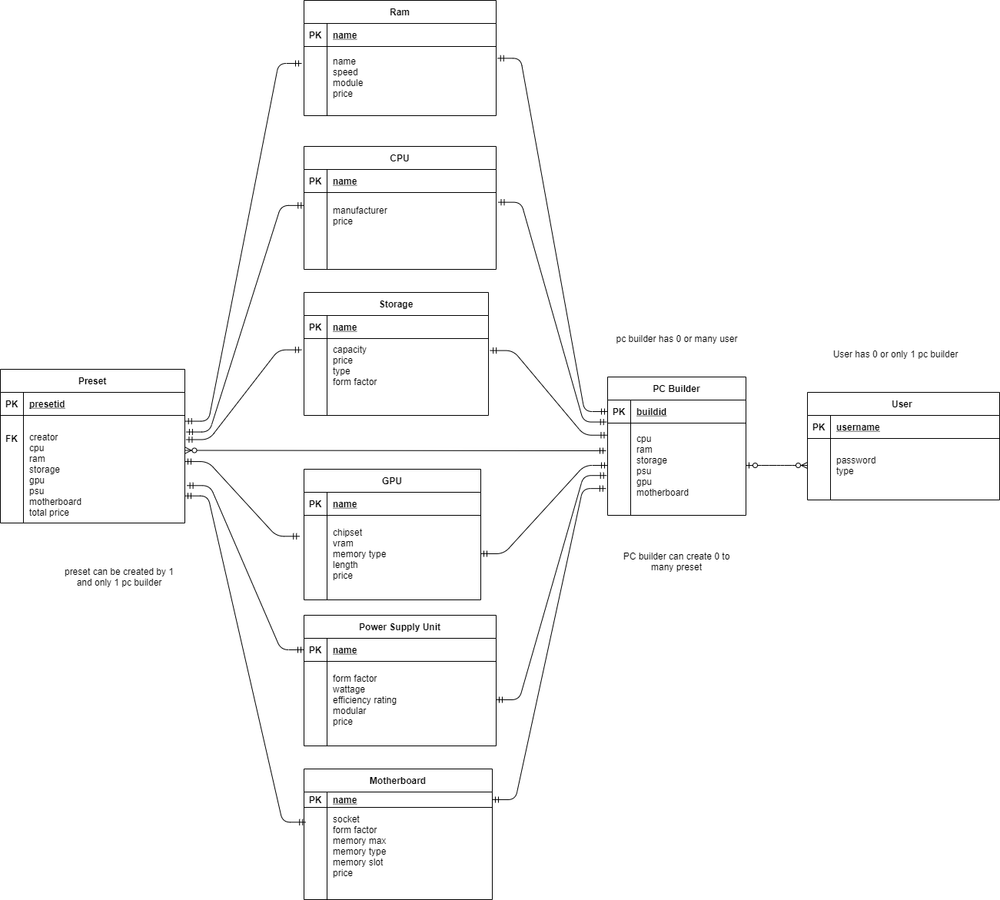
 

<h2> Sequence Diagram.</h2>

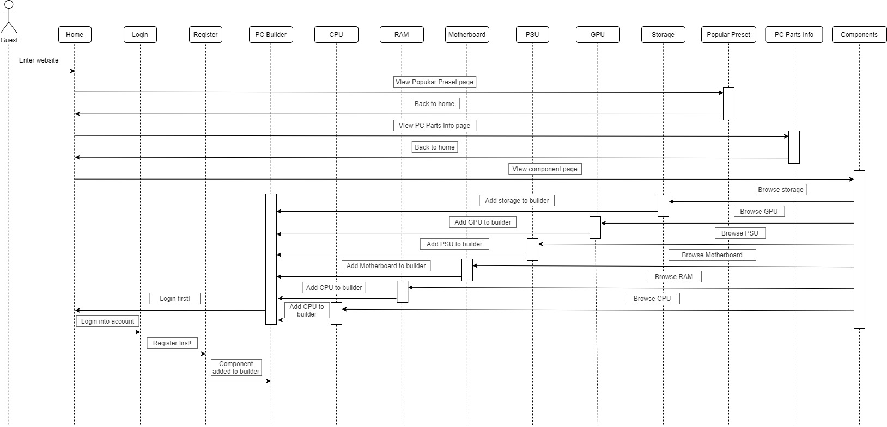
 

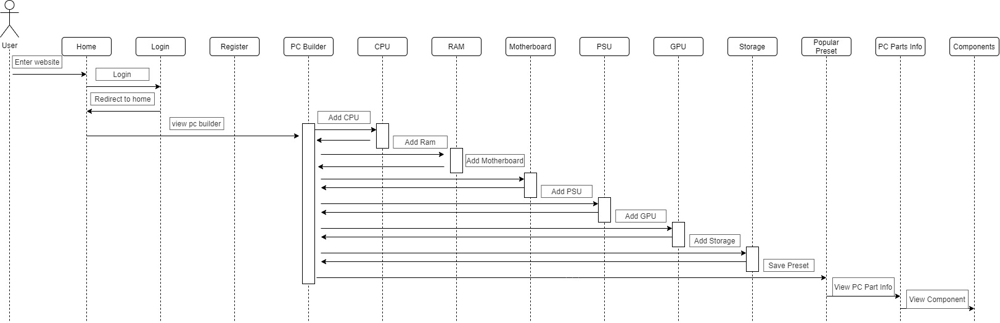
 

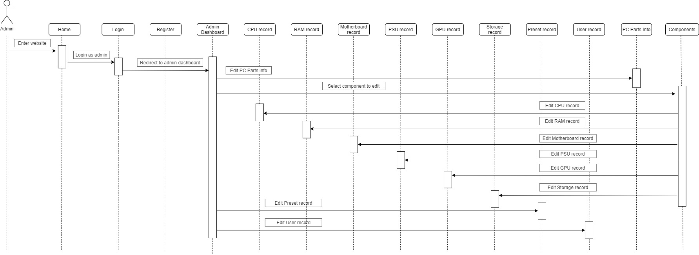
 

<h2> Project System Captured Screen</h2>
 
<<<<<<< HEAD

<ol>
    <li><h3>Home Page<h3></li>
    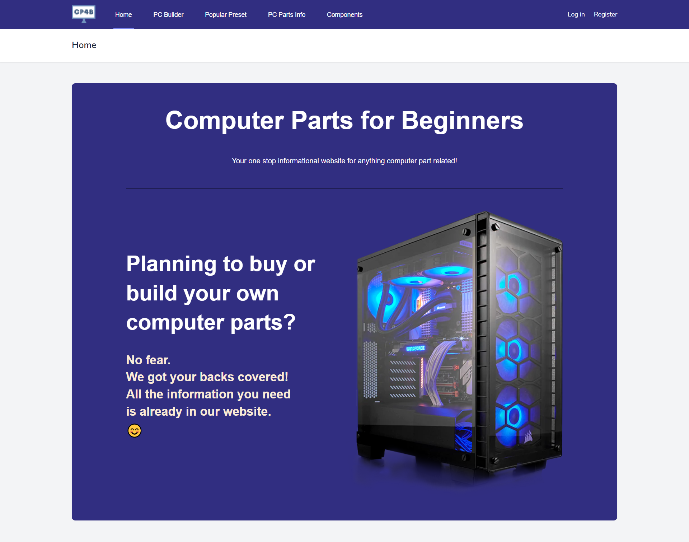
    
 	Everybody will be redirected to the homepage when they first come to the website. Also, when user and admin login, they will be redirected to homepage first. Homepage show description about the Computer Parts for Beginners website.

     
    <li><h3>Login Page<h3></li>
    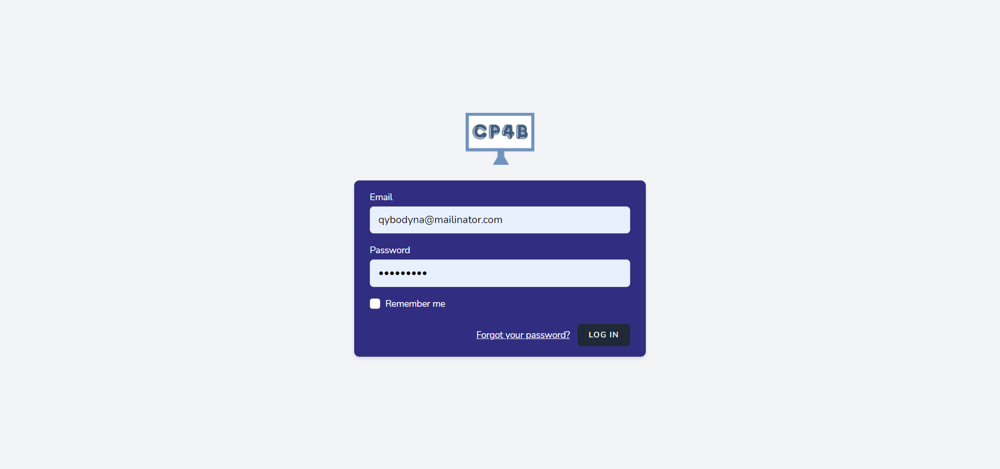
    
The login page basically is the template of the laravel breeze authentication but we made some changes to the colour. User need to fill in their email and password to login.
    

     
    <li><h3>Register Page<h3></li>
    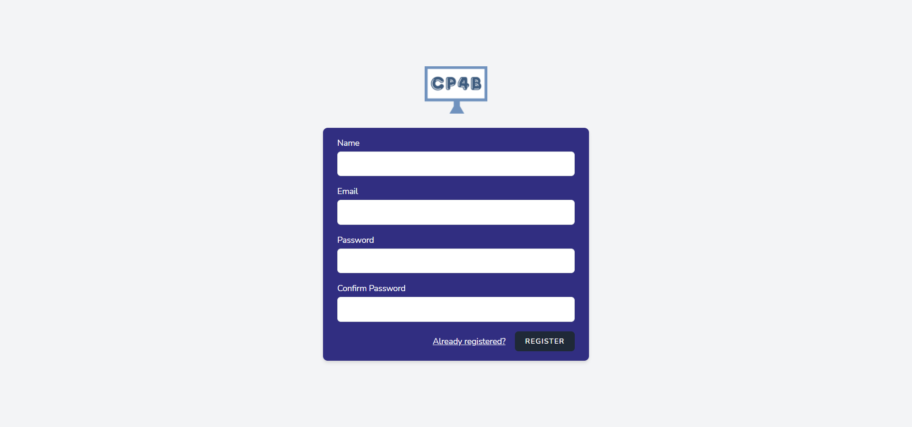
    
 The register page is also based on the template of the laravel breeze authentication. We made some changes by replacing the logo with our own logo that show 'CP4B' which stand for Computer Parts For Beginners.

     
    <li><h3>PC Builder Page<h3></li>
    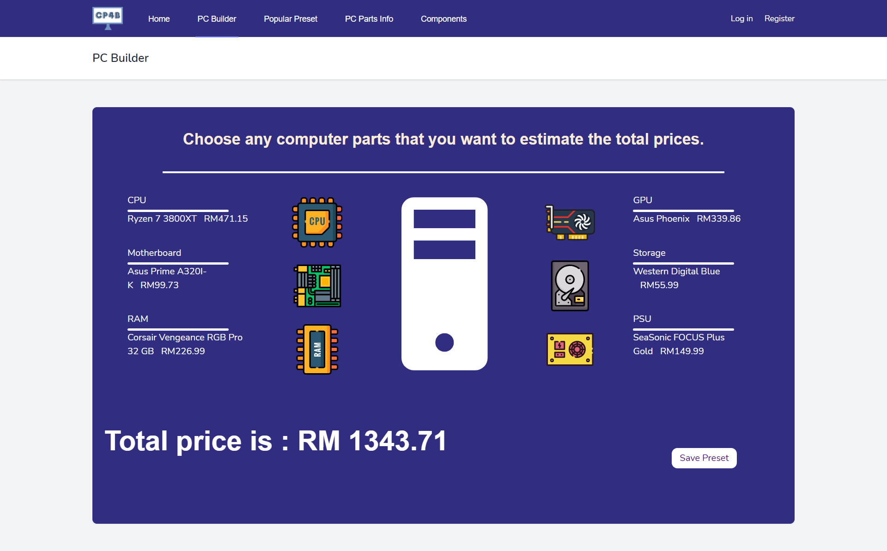
    
In this PC Builder page, user can estimate the cost of the PC parts that they want. They can add any pc part by clicking 'Choose CPU' for example . Then, it will redirect to Components>CPU page that show the list of CPU name and price that they can add to the PC Builder.  

     
    <li><h3>Popular Preset<h3></li>
    
    
Popular Preset page will show the build that was created by the users. There is two tables, which is one to show the build id with the total price. The other table will show the preset details which consist of each component name and price for the specific preset.
    

     
    <li><h3>PC Parts Info<h3></li>
    
    
 In PC Parts Info page, it basically display the information about the important PC parts. User can know more about the CPU, RAM, GPU, Storage and Motherboard by reading the details of each component.

     
    <li><h3>Components<h3></li>
    
    
In Components, the page listed links to each components part lists page.  

     
    <li><h3>Admin View Records<h3></li>
    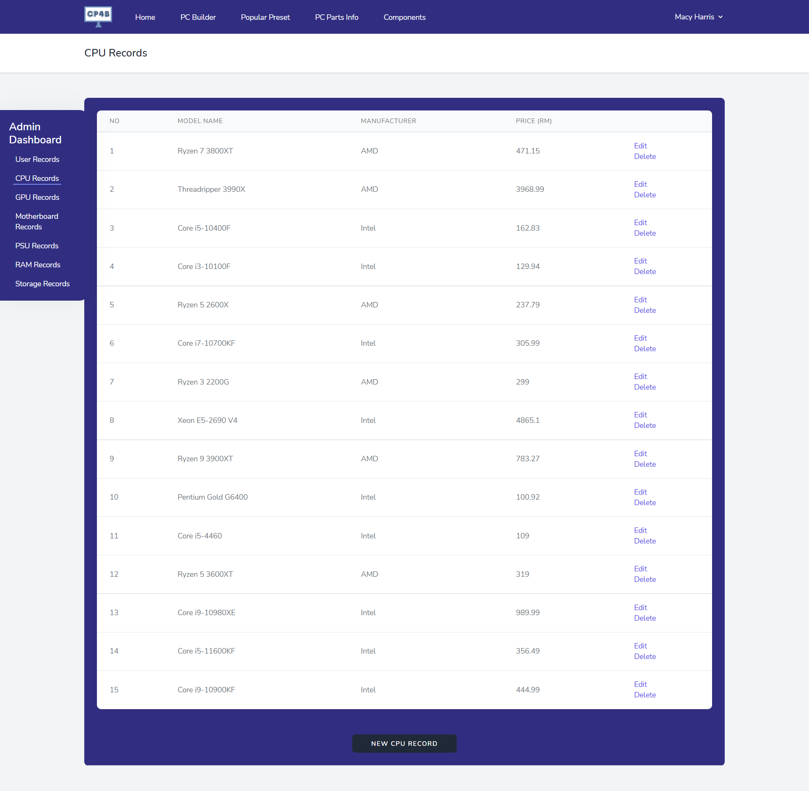
    
Admin can view the any records available in the database. For example, they can view users, GPU,CPU and other component record.  

     
    <li><h3>Admin Edit Records<h3></li>
    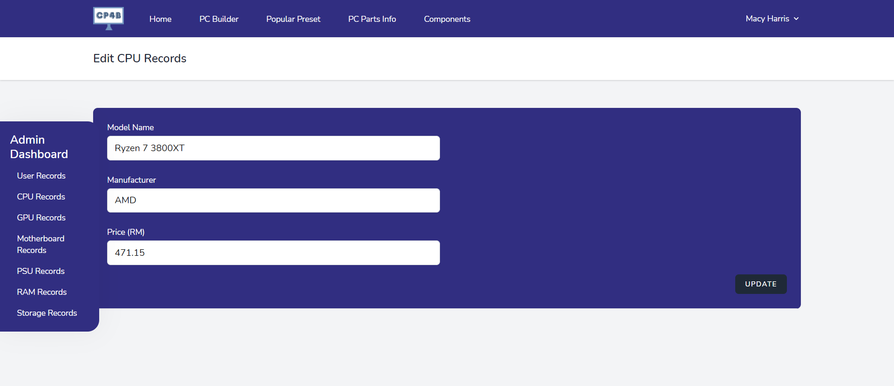
    
Admin has privilege to edit the records of user and each PC part record. They can do so in when clicking the user record under admin dashboard. For user, admin change the roles either as admin or user. For component record, admin can edit each component attribute such as name and price.  

     
    <li><h3>Admin Create New Records<h3></li>
    
    
At the bottom of the list of component record, admin can create new record by pressing "NEW CPU RECORD". They will be redicted to a page that they can fill in the details for the new record. 

     
</ol>
=======
 <ol>
  <li><h3>Home Page<h3></li>
   
   
 	Everybody will be redirected to the homepage when they first come to the website. Also, when user and admin login, they will be redirected to homepage first. Homepage show description about the Computer Parts for Beginners website.

    
  <li><h3>Login Page<h3></li>
   
   
The login page basically is the template of the laravel breeze authentication but we made some changes to the colour. User need to fill in their email and password to login.
 

    
  <li><h3>Register Page<h3></li>
   
   
 The register page is also based on the template of the laravel breeze authentication. We made some changes by replacing the logo with our own logo that show 'CP4B' which stand for Computer Parts For Beginners.

    
  <li><h3>PC Builder Page<h3></li>
   
   
In this PC Builder page, user can estimate the cost of the PC parts that they want. They can add any pc part by clicking 'Choose CPU' for example . Then, it will redirect to Components>CPU page that show the list of CPU name and price that they can add to the PC Builder.  

    
  <li><h3>Popular Preset<h3></li>
   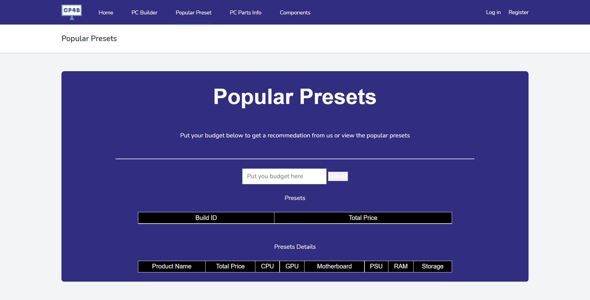
   
Popular Preset page will show the build that was created by the users. There is two tables, which is one to show the build id with the total price. The other table will show the preset details which consist of each component name and price for the specific preset.
 

    
  <li><h3>PC Parts Info<h3></li>
   
   
 In PC Parts Info page, it basically display the information about the important PC parts. User can know more about the CPU, RAM, GPU, Storage and Motherboard by reading the details of each component.

    
  <li><h3>Components<h3></li>
   
   
In Components, the page listed links to each components part lists page.  

    
  <li><h3>Admin View Records<h3></li>
   
   
Admin can view the any records available in the database. For example, they can view users, GPU,CPU and other component record.  

    
  <li><h3>Admin Edit Records<h3></li>
   
   
Admin has privilege to edit the records of user and each PC part record. They can do so in when clicking the user record under admin dashboard. For user, admin change the roles either as admin or user. For component record, admin can edit each component attribute such as name and price.  

    
  <li><h3>Admin Create New Records<h3></li>
   
   
At the bottom of the list of component record, admin can create new record by pressing "NEW CPU RECORD". They will be redicted to a page that they can fill in the details for the new record. 

    
 </ol>
   
<h2>Challenges and Difficulties in Developing the Application</h2>
<ol>
 <li> Have to figure out how to have many roles in a website (configuring laratrust). </li>
 <li> How to integrate blade, php and html component in php file.</li>
 <li> Not enough time to give the finishing touch because too busy in making the website to be functional.</li>
</ol>
    
   
<h2> References.  </h2>
<ol>
  <li>Pick parts. Build your PC. Compare and share. (2021). Pcpartpicker.com; PCPartPicker. https://pcpartpicker.com/</li>
</ol>

